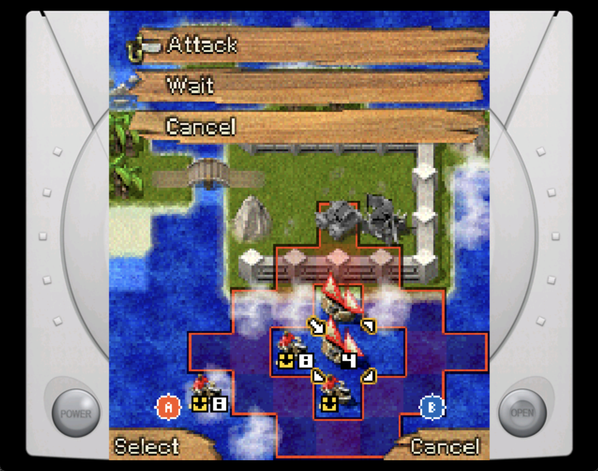
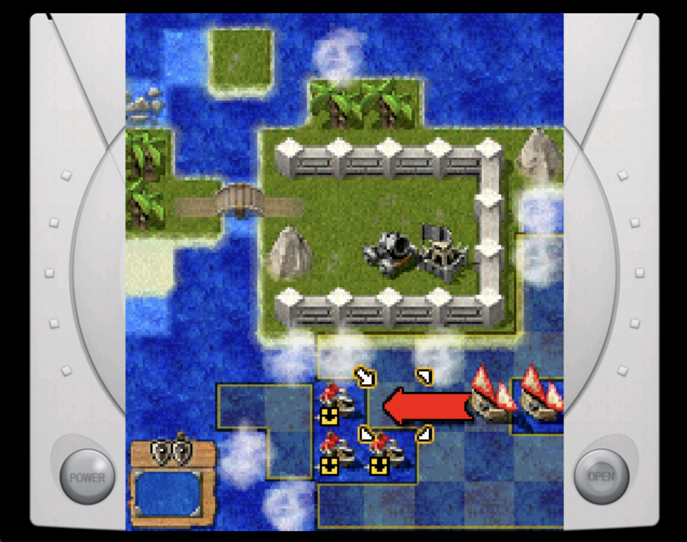
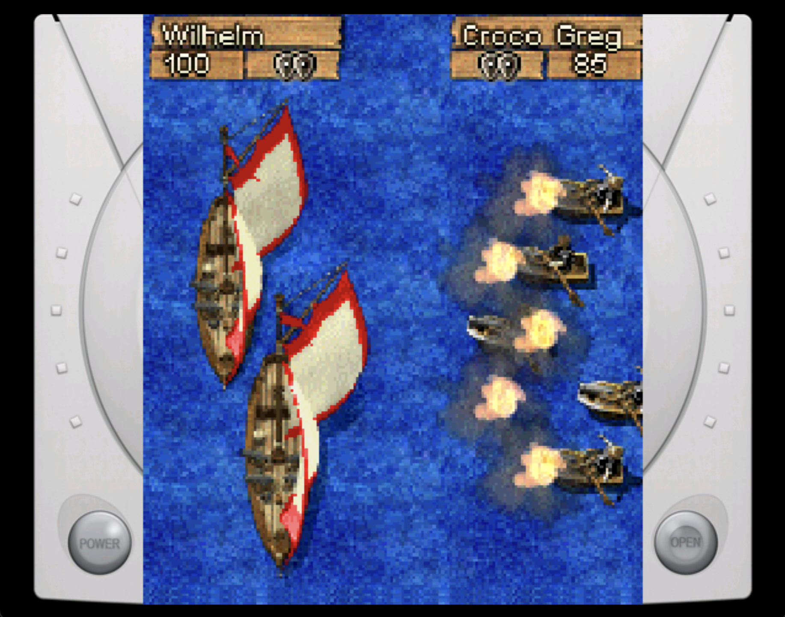
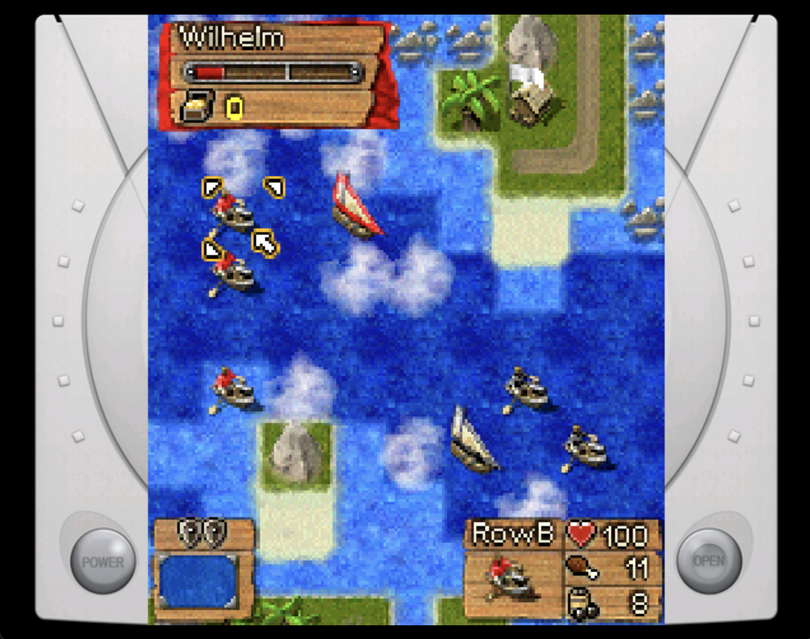
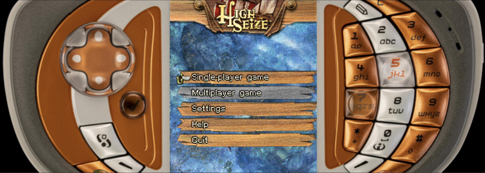

# High Seize — a port for desktop and Dreamcast

Native re-implementation of *High Seize* (RedLynx, N-Gage) for the desktop and the
Sega Dreamcast. Internal port name: **blackbeard**.

<table>
  <tr>
    <td width="50%"></td>
    <td width="50%"></td>
  </tr>
  <tr>
    <td width="50%"></td>
    <td width="50%"></td>
  </tr>
  <tr>
    <td colspan="2"></td>
  </tr>
</table>

## Game data

This repo doesn't include `data.pak`, the original game's assets — you have to bring
your own. In an N-Gage install it is usually at
`App/System/Apps/6R36/data/data.pak`.

The desktop build takes its path on the command line. The Dreamcast disc script
looks for `$BB_PAK`, then `data.pak` in the repository root, so copying it there is
the easiest thing to do.

## Layout

```
src/shim/       mini-Symbian: descriptors, logging, and the data.pak reader
src/platform/   host seam + software rendering; SDL2 and KallistiOS backends
src/game/       ported game logic
assets/         soft-key icon paks and the device frame art — non-original assets
scripts/        Dreamcast build and disc-image scripts
screenshots/    the pictures above
third_party/    vfspp (submodule) and stb_image
```

## Build

Clone with submodules — vfspp is one, and the build will not configure without it:

```sh
git clone --recurse-submodules https://github.com/nextgeniuspro/hs-dc.git
cd hs-dc
```

### Desktop

Needs CMake 3.16+, a C++20 compiler, zlib and SDL2. Everything but SDL2 is
mandatory; without SDL2, CMake still configures and the libraries still build, but
you get no `blackbeard` binary — it prints `SDL2 not found: the libraries will
build, but no app target`, which is the line to look for if the executable isn't
where you expect it.

### macOS

Download SDL2 framework, execute once

```sh
scripts/fetch-sdl2-mac.sh
```

Generate project

```sh
cmake -S . -B build -DBB_MAC_BUNDLE=ON
```

```sh
cmake --build build -j
```

### Windows

Build game with command

```sh
cmake -S . -B build && cmake --build build -j
```

### Dreamcast

Needs a KallistiOS toolchain with **zlib from kos-ports** (`cd $KOS_PORTS/zlib &&
make install` — the build stops with a message if it's missing), and
[mkdcdisc](https://gitlab.com/simulant/mkdcdisc) on the `PATH` for the disc image.
Python with Pillow is optional: without it the disc simply carries no device frames.

You do not need to source `environ.sh` yourself — `scripts/dc-env.sh` does it, and
defaults to `/opt/toolchains/dc/kos/environ.sh`. If your install lives elsewhere,
point `BB_KOS_ENVIRON` at its `environ.sh`:

```sh
export BB_KOS_ENVIRON=<path-to-kos>/environ.sh   # only if it isn't in /opt/toolchains
```

Build the ELF, then turn it and the assets into a bootable image:

```sh
./scripts/dc-build.sh                # -> build-dc/blackbeard.elf
./scripts/dc-cdi.sh                  # -> build-dc/blackbeard.cdi
./scripts/dc-cdi.sh --pak /path/to/data.pak   # if it isn't in the repo root
./scripts/dc-cdi.sh --no-pak         # -> build-dc/blackbeard-sd.cdi
```

The image is unpadded (~32 MB) by default, which is what an emulator wants. Pass
`--pad` for a CD-R: it pads out to the full 700 MB so the game sits at the disc's
edge, where a real drive reads fastest.


## The device frame

The screen is 176x208 — an 11:13 portrait shape nothing on a desk has. Rather
than pillarbox it into black, the port fills the space either side with a
picture of the machine the game shipped on: the left half of an N-Gage QD, with
its d-pad, on the left, the keypad half on the right, both scaled to the height
of the screen and butted against its edges. They run off the sides of the
window and are cropped by it, which is the point — you are looking at the
middle of a device too big for the display, not at a photograph pasted beside
the game.

Three frames ship — N-Gage, N-Gage QD and Dreamcast — and Settings picks between
them, or turns them off. The QD is the default. The save stores the frame's id
rather than its position in the list, so adding a frame never moves anybody's
choice out from under them.

The screen itself is *fitted*, never filled: it keeps its shape whatever the
window is, so on anything wider than 11:13 the fit comes out as the full window
height and the frame reaches top to bottom. That arithmetic is
`src/platform/ScreenLayout.h`, deliberately plain integers in `bb_platform` rather
than SDL rects in the backend — a few percent of stretch is the kind of thing
nobody sees and everybody feels, and keeping it away from SDL keeps it something
you can check on its own across a spread of window shapes.

A frame is two PNGs and a line in a manifest:

```
assets/frames/frames.txt          "ngage-qd<TAB>N-Gage QD"
assets/frames/ngage-qd/left.png
assets/frames/ngage-qd/right.png
```

